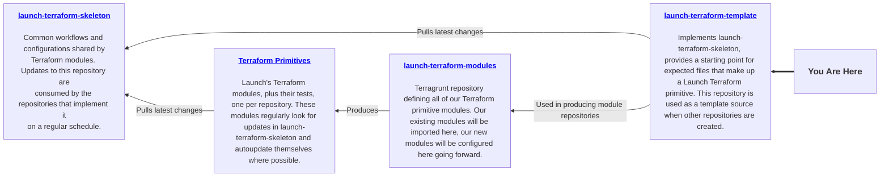

# TF Module Template

[](https://opensource.org/licenses/Apache-2.0)
[](https://creativecommons.org/licenses/by-nc-nd/4.0/)

## Overview

This repository contains an example Terraform module that is designed to be transformed into another module.



## How to Use This Repo

This repo is intended to be used as a template for any new TF module.

> [!CAUTION]
> Your changes only belong in this repo if they modify the default module, examples, tests, or documentation used for Terraform Primitive templating purposes. If you need to make changes to the shared configuration files and workflows, see the [launch-terraform-skeleton](https://github.com/launchbynttdata/launch-terraform-skeleton) repository.
>
> If you need to create a new Terraform module, see the launch-terraform-modules](https://github.com/launchbynttdata/launch-terraform-modules) repository.

## Pre-Requisites

The following commands should be available on your system:

- `asdf` or `mise`
- `make`
- `python3` (for pre-commit)

Additionally, your `git` user and email must be configured. Run the `make configure` command from the root of the repository to ensure that you meet these requirements.

### Templating

#### GitHub Templating

This repository is used as a GitHub template by the [launch-terraform-modules](https://github.com/launchbynttdata/launch-terraform-modules) repository. If you are a Launch Engineer who needs to create a new Terraform module, you should start there.

#### Manual Templating

This applies to systems like Azure DevOps and CodeCommit.

We need to clone the repo and start a fresh git history to get rid of the `launch-terraform-template` history. Below is a loose explanation of how to do this.

``` shell
git clone <this repo's URL> tf-<whatever it is you're building>
cd tf-<whatever it is you're building>
rm -rf .git
git init -b main
```

#### Remove Educational Material

We need to clear out the example code (different from the boilerplate code). We want to save the repo structure; we don't need the contents. There are `examples`, and `tests` that apply to the boilerplate that we're not going to need as developers of new modules.

Note: Before you clear these things out, it's useful to actually understand what they are and why they're there. We'll be building our own as we go forward, so we need to know what it is we're removing. If this isn't your first module, it's safe to fly through this. If this is your first (or your first several, even), take the time to read the code before you remove it.

```shell
cd path/to/this/repo
rm -rf examples/*
rm -rf README.md
mv TEMPLATED_README.md README.md
```

### Repo Setup

#### Module Configuration

- You'll need to update [`versions.tf`](./versions.tf) based on your provider needs.

## Explanation of the Template

### Resources and Providers

In this example module we generate text resources with the `random` provider in a similar manner to our Terraform Primitive Modules, with a single resource in the root module and at least one example module instantiating that root module. In reality, the provider tends to be a cloud provider (our ecosystem has strong support for `aws` and `azure*` providers).

### Module Guidelines

- Each repository should have a default module in its root
  - Should have default values and be instantiable with minimal to no inputs
  - We can think of these default values as the "default example"
- A `Makefile` provides tasks for terraform module development
  - For clearing cached components, it provides a `make clean` command
  - Linter config and other shared files are defined in the [launch-terraform-skeleton](https://github.com/launchbynttdata/launch-terraform-skeleton) repository. This template and the modules created from it will automatically check for updates of the skeleton.
- An `examples` folder contains example uses of the default and nested modules
  - There should be at least one example for each nested module
  - For modules that are compatible with more than one major version of a provider, an example using the latest minor/patch release of every supported major version must be included.
- A `tests` folder contains Go functional tests
  - Make pre-deploy tests that validate terraform plan json where applicable
  - Make post-deploy tests that validate the deployment where applicable
- Provider should be configured by the consumer of this module, not the module itself
  - Modules only define what providers/versions are required
  - provider.tf is generated on the fly by tests/examples when needed

### Go Functional Tests

- Modules are how Go manages dependencies
- To initiate a new module, run the command: `go mod init [repo_url]`
  - It is recommended to use the absolute repository url (e.g. github.com/launchbynttdata/launch-terraform-template)
- Relative path is highly discouraged in Go, use absolute path to import a package
  - (e.g. `github.com/launchbynttdata/launch-terraform-template/[path_to_file]`)
- To update paths or versions, run the command: `go get -t ./...`; Go will update the dependencies accordingly

### Workflows

This template includes workflows to check both an AWS and an Azure Terraform module using our launch-workflows repository's reusable workflows. The workflow will automatically select between the correct provider authentication method based on the name of the downstream repository.

The `launchbynttdata` organization has the appropriate secrets and variables set for these workflows, but if you intend to use them outside of the `launchbynttdata` organization, you may need to configure secrets and variables for your use case. See the [documentation in launch-workflows](https://github.com/launchbynttdata/launch-workflows/tree/main/docs) for more details specific to your desired workflow.

<!-- BEGIN_TF_DOCS -->
## Requirements

| Name | Version |
|------|---------|
| <a name="requirement_terraform"></a> [terraform](#requirement\_terraform) | ~> 1.0 |
| <a name="requirement_random"></a> [random](#requirement\_random) | ~> 3.6 |

## Providers

| Name | Version |
|------|---------|
| <a name="provider_random"></a> [random](#provider\_random) | 3.8.1 |

## Modules

No modules.

## Resources

| Name | Type |
|------|------|
| [random_string.string](https://registry.terraform.io/providers/hashicorp/random/latest/docs/resources/string) | resource |

## Inputs

| Name | Description | Type | Default | Required |
|------|-------------|------|---------|:--------:|
| <a name="input_length"></a> [length](#input\_length) | n/a | `number` | `24` | no |
| <a name="input_number"></a> [number](#input\_number) | n/a | `bool` | `true` | no |
| <a name="input_special"></a> [special](#input\_special) | n/a | `bool` | `false` | no |

## Outputs

| Name | Description |
|------|-------------|
| <a name="output_string"></a> [string](#output\_string) | n/a |
<!-- END_TF_DOCS -->
